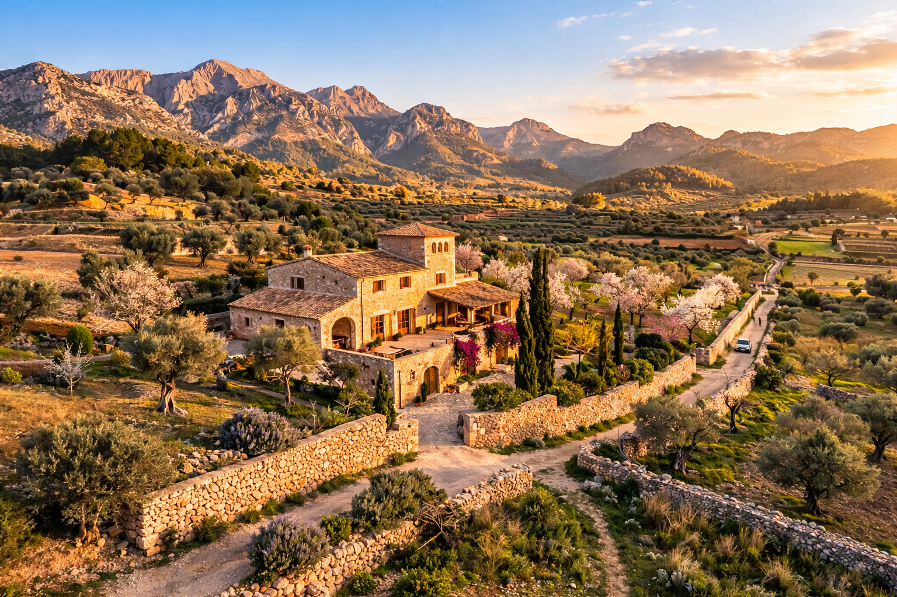

<p align="center">
  
</p>

<h1 align="center">🫒 Son Mullet</h1>
<p align="center">
  <strong>Agroturismo auténtico en la Serra de Tramuntana, Mallorca</strong>
</p>

<p align="center">
  <a href="#-características"></a>
  <a href="#-tecnologías"></a>
  <a href="LICENSE"></a>
</p>

<p align="center">
  <em>Experiencias rurales · Gastronomía local · La esencia del Mediterráneo</em>
</p>

---

## 📖 Descripción

**Son Mullet** es la landing page de un agroturismo ficticio ubicado en un monte de la isla de Mallorca. El proyecto ofrece una experiencia visual inmersiva con estilo **mediterráneo y rústico**, invitando tanto a turistas extranjeros como locales a descubrir vivencias auténticas en plena Serra de Tramuntana.

> 🌿 *Pasea entre olivos centenarios, degusta la cocina tradicional y contempla los atardeceres más espectaculares de la isla.*

---

## ✨ Características

| Sección | Descripción |
|:---|:---|
| 🏔️ **Hero** | Imagen a pantalla completa con efecto zoom, título animado y CTAs |
| 📜 **Sobre nosotros** | Historia de la finca, badge de tradición e iconos de servicios |
| 🫒 **Experiencias** | Tarjetas interactivas: recogida de aceitunas, cena bajo las estrellas, alojamiento |
| 🖼️ **Galería** | Tira de imágenes con scroll infinito animado |
| 📅 **Reservas** | Formulario completo (fechas, huéspedes, tipo de estancia) |
| 📬 **Contacto** | Datos de contacto + formulario de mensajes |
| 🔗 **Footer** | Navegación, experiencias, avisos legales |

### Extras de diseño

- 🎨 **Paleta mediterránea** — terracota, verde oliva, arena, piedra, azul cielo
- 🔤 **Tipografía premium** — *Playfair Display* + *Lato* (Google Fonts)
- ✨ **Animaciones** — scroll-reveal, hover lift en tarjetas, galería infinita
- 🪟 **Header glassmorphism** — fondo difuminado al hacer scroll
- 📱 **100% responsive** — diseño adaptado a móvil, tablet y escritorio
- 🍔 **Menú hamburguesa** — navegación lateral animada en móvil

---

## 🛠️ Tecnologías

| Tecnología | Uso |
|:---|:---|
| **HTML5** | Estructura semántica |
| **CSS3 (vanilla)** | Estilos, animaciones, responsive design |
| **JavaScript (vanilla)** | Interactividad, navegación, formularios |
| **Google Fonts** | Tipografías Playfair Display y Lato |

> Sin frameworks ni dependencias externas — solo HTML, CSS y JS puro.

---

## 📂 Estructura del proyecto

```
sonMullet/
├── images/
│   ├── header_background.png   # Hero principal
│   ├── hero.png                # Finca de Son Mullet
│   ├── landscape.png           # Serra de Tramuntana
│   ├── dining.png              # Cena al aire libre
│   ├── olives.png              # Recogida de aceitunas
│   └── room.png                # Habitación rústica
├── index.html                  # Landing page principal
├── reloj-animado.html          # Extra: reloj animado
├── LICENSE                     # CC0 1.0 Universal
└── README.md                   # Este archivo
```

---

## 🚀 Cómo usar

1. **Clona** el repositorio:
   ```bash
   git clone https://github.com/tu-usuario/sonMullet.git
   cd sonMullet
   ```

2. **Abre** `index.html` directamente en tu navegador, o lanza un servidor local:
   ```bash
   npx http-server . -p 8080
   ```

3. **Visita** `http://localhost:8080` 🎉

---

## 📱 Responsive Design

La web se adapta a cualquier dispositivo:

| Dispositivo | Breakpoint | Layout |
|:---|:---|:---|
| 🖥️ Desktop | > 992px | Grids de 2–3 columnas |
| 📱 Tablet | 768–992px | Grids de 1–2 columnas |
| 📱 Móvil | < 768px | Una columna + menú hamburguesa |

---

## 🎨 Paleta de colores

| Color | Hex | Uso |
|:---|:---|:---|
| 🟫 Terracota | `#B85C38` | Acentos, CTAs, enlaces activos |
| 🟢 Verde oliva | `#6B7F3B` | Etiquetas, botón de contacto |
| 🟤 Piedra | `#3E2723` | Textos principales, header, footer |
| 🟡 Arena | `#E8D5B7` | Fondos claros, badges |
| ⬜ Fondo | `#FAF5EF` | Color de fondo general |
| 🔵 Cielo | `#7AACCF` | Acentos secundarios |

---

## 🗺️ Roadmap

- [x] Landing page estática con todas las secciones
- [x] Diseño responsive (mobile-first)
- [x] Animaciones scroll-reveal y galería infinita
- [ ] Integración con **Node.js** (backend)
- [ ] Base de datos **MongoDB Atlas** para reservas
- [ ] Sistema de autenticación de usuarios
- [ ] Internacionalización (ES / EN / DE)
- [ ] SEO avanzado y meta tags dinámicos

---

## 📄 Licencia

Este proyecto está bajo la licencia [CC0 1.0 Universal](LICENSE) — dominio público.

---

<p align="center">
  <em>Hecho con 🫒 desde Mallorca</em>
</p>
